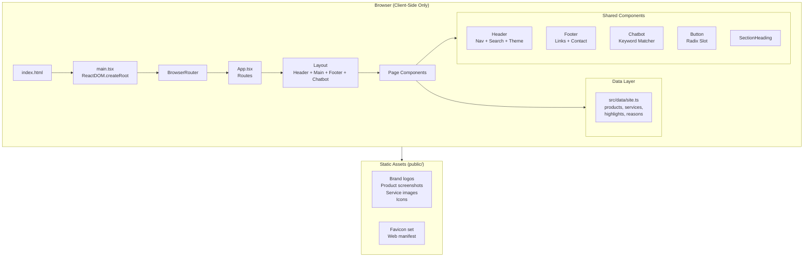

# SMVM Software — Web Portal

> **Modern marketing website for SMVM Software (branded as "SMVM Softwares" in the UI), a Coimbatore-based technology company specializing in POS systems, medical billing, business automation, and custom software development.**

---

## Naming Clarification

The repository contains inconsistent naming across different layers:

| Source                        | Name used               |
| ----------------------------- | ----------------------- |
| `package.json` → `name`      | `smvm-web`              |
| `index.html` → `<title>`     | **SMVM Softwares**      |
| `site.webmanifest`            | *(empty `name` field)*  |
| Header component (UI)        | **SMVM Softwares**      |
| Footer component (UI)        | **SMVM Softwares**      |
| `doc/00-MASTER-README.md`    | **SMVM Software**       |
| `doc/IMPLEMENTATION_AUDIT.md`| **SMVM Software**       |
| `doc/10-PROJECT-STRUCTURE.md`| `smbm-web/` (typo)     |

The deployed UI consistently uses **"SMVM Softwares"** (plural). The specification documents use **"SMVM Software"** (singular). The directory reference `smbm-web` in `doc/10-PROJECT-STRUCTURE.md` appears to be a typo. This README uses **"SMVM Software"** (the specification name) except when quoting literal UI text.

---

## Table of Contents

- [Project Overview](#project-overview)
- [Quick Start](#quick-start)
- [Technology Stack](#technology-stack)
- [Features and User Journeys](#features-and-user-journeys)
- [Page-by-Page Application Guide](#page-by-page-application-guide)
- [Architecture and Data Flow](#architecture-and-data-flow)
- [Repository and File Structure](#repository-and-file-structure)
- [Installation and Configuration](#installation-and-configuration)
- [Development Workflow](#development-workflow)
- [API and Backend Reference](#api-and-backend-reference)
- [Data Model and Persistence](#data-model-and-persistence)
- [Authentication and Security](#authentication-and-security)
- [Testing and Quality](#testing-and-quality)
- [Build, Deployment, and Operations](#build-deployment-and-operations)
- [Troubleshooting](#troubleshooting)
- [Accessibility, Performance, and Maintainability](#accessibility-performance-and-maintainability)
- [Roadmap and Known Limitations](#roadmap-and-known-limitations)
- [Contributing, Support, and License](#contributing-support-and-license)
- [Glossary and Documentation Questions](#glossary-and-documentation-questions)

---

## Project Overview

SMVM Software Web Portal is a **static, client-side React marketing website** for SMVM Software, a technology company based in Coimbatore, Tamil Nadu, India. The company builds POS (Point of Sale) products for retail and medical/pharmacy businesses, and offers web development, mobile app development, custom software, and consulting services.

### What This Repository Contains

A fully implemented **dark/light-themed single-page application** serving as the company's public web presence. There is **no backend, no database, no authentication, and no server-side API**. All data is embedded in TypeScript source files and rendered client-side.

### Primary Use Cases

1. **Company marketing** — Present SMVM Software's products and services to prospective customers.
2. **Product showcase** — Detail four POS products (CamStore POS, CamBill POS, MediBill POS, MediBill Pro) with descriptions, features, and screenshots.
3. **Service promotion** — Highlight four technology services (web development, custom software, mobile/Android apps, consulting).
4. **Lead capture** — Provide a contact enquiry form (clipboard-based; no backend submission).
5. **Customer engagement** — Floating chatbot widget with keyword-matching responses.

### Current Implementation Status

| Area                     | Status           | Notes                                                      |
| ------------------------ | ---------------- | ---------------------------------------------------------- |
| Core pages (8 routes)    | ✅ Complete       | All pages render and navigate correctly                    |
| Responsive layout        | ✅ Complete       | Mobile-first with breakpoints at sm/md/lg/xl               |
| Light/Dark theme         | ✅ Complete       | System-aware with localStorage persistence                 |
| Product data architecture| ✅ Complete       | Data-driven from `src/data/site.ts`                        |
| Animations               | ✅ Complete       | Framer Motion throughout, with `prefers-reduced-motion`    |
| Chatbot widget           | ✅ Complete       | Local keyword matching; no external AI/API                 |
| Site search              | ✅ Complete       | Ctrl/⌘+K search dialog across products and services       |
| Skip-to-content link     | ✅ Complete       | Accessible keyboard shortcut                               |
| Contact form backend     | ⚠️ Partial       | Form copies to clipboard; no server submission             |
| Per-page SEO meta        | ❌ Not implemented| Only global `<title>` and `<meta description>` in HTML    |
| OpenGraph / Twitter cards | ❌ Not implemented| No OG images or social meta tags                          |
| Sitemap / robots.txt     | ❌ Not implemented| No `sitemap.xml` or `robots.txt` in `public/`             |
| JSON-LD structured data  | ❌ Not implemented| No schema.org markup                                      |
| Automated tests          | ❌ Not implemented| No test framework, no test files                          |
| CI/CD pipeline           | ❌ Not implemented| No GitHub Actions, Vercel config, or deployment scripts   |
| Analytics                | ❌ Not implemented| No analytics integration                                  |
| Linting/formatting       | ❌ Not implemented| No ESLint or Prettier configuration                       |

### Feature Summary

**Working features:**
- 8 navigable pages with client-side routing
- Sticky header with mega-navigation, search dialog, and theme toggle
- Product tour lightbox with keyboard navigation and focus trapping
- 4 product detail/overview pages with screenshot galleries
- Contact enquiry form with clipboard copy and fallback display
- Floating chatbot with quick prompts and keyword-matched responses
- Comprehensive footer with product, service, and navigation links
- CSS design system with HSL custom properties for light and dark themes
- Responsive glass-card, product-card, and service-card component library
- Custom scrollbar, noise texture, glow, and floating animation utilities

**Partial implementations:**
- Contact form: captures input but only copies to clipboard (no backend)
- Legal pages (`/privacy`, `/terms`): placeholder content stating policies are not yet published
- Testimonials section: renders a "coming soon" placeholder with empty state
- Social media links: all point to `#` (placeholder)
- Phone number: uses placeholder `+91-XXX-XXX-XXXX` (not supplied)
- `site.webmanifest`: `name` and `short_name` fields are empty strings

---

## Quick Start

### Prerequisites

| Software   | Minimum Version | Verification Command |
| ---------- | --------------- | -------------------- |
| Node.js    | 18+             | `node --version`     |
| npm        | 9+              | `npm --version`      |

### Steps

```powershell
# 1. Clone or navigate to the repository
cd "D:\SMVM Web"

# 2. Install dependencies
npm install

# 3. Start the development server
npm run dev
```

After running `npm run dev`, Vite will start a local development server (typically at `http://localhost:5173`). Open this URL in a browser to see the SMVM Software website with hot module replacement enabled.

### What You Should See

A dark-themed marketing website with:
- A hero section featuring "Where Creativity Meets Innovation" headline
- Product showcase cards for CamStore POS, CamBill POS, MediBill POS, and MediBill Pro
- A floating chatbot bubble in the bottom-right corner
- A sticky header with navigation, search (Ctrl+K), and light/dark theme toggle

---

## Technology Stack

| Layer            | Technology                    | Version   | Role                                          | Evidence                          |
| ---------------- | ----------------------------- | --------- | --------------------------------------------- | --------------------------------- |
| **Runtime**      | React                         | ^18.2.0   | UI component rendering                        | `package.json`                    |
| **Language**     | TypeScript                    | ^5.2.2    | Static typing and type safety                 | `package.json`, `tsconfig.json`   |
| **Build Tool**   | Vite                          | ^5.1.6    | Dev server with HMR, production bundling      | `package.json`, `vite.config.ts`  |
| **Styling**      | Tailwind CSS                  | ^3.4.1    | Utility-first CSS with custom design tokens   | `package.json`, `tailwind.config.js` |
| **CSS Processing** | PostCSS + Autoprefixer      | ^8.4.35   | CSS transforms and vendor prefixes            | `postcss.config.js`               |
| **Routing**      | React Router                  | ^6.22.3   | Client-side SPA routing                       | `package.json`, `src/App.tsx`     |
| **Animation**    | Framer Motion                 | ^11.0.8   | Page transitions, hover effects, lightboxes   | `package.json`, component files   |
| **Icons**        | Lucide React                  | ^0.344.0  | Consistent SVG icon library                   | `package.json`, component imports |
| **UI Primitives**| Radix UI Slot                 | ^1.3.3    | Polymorphic `asChild` button pattern          | `package.json`, `Button.tsx`      |
| **Utilities**    | clsx + tailwind-merge         | ^2.1.0/^2.2.1 | Conditional class name composition        | `package.json`, `src/lib/utils.ts`|
| **Vite Plugin**  | @vitejs/plugin-react          | ^4.2.1    | React Fast Refresh for Vite                   | `package.json`, `vite.config.ts`  |

### Architectural Choices

- **No backend**: This is a purely static brochure site. The contact form uses `navigator.clipboard.writeText()` instead of sending data to a server. The chatbot uses local keyword matching.
- **No global state management**: No Redux, Zustand, or Context API. All application data is defined as constants in [`src/data/site.ts`](src/data/site.ts) and imported directly by components.
- **CSS-first design system**: Design tokens are defined as HSL CSS custom properties in [`:root`](src/index.css) with light and dark variants, mapped to Tailwind via [`tailwind.config.js`](tailwind.config.js). Extensive use of `@layer components` for glass-card, product-card, service-card, and button classes.
- **Theme system**: Uses Tailwind's `darkMode: 'class'` strategy. The `.dark` class is toggled on `<html>` based on system preference with localStorage override. The [`Header`](src/components/layout/Header.tsx) component manages the toggle.
- **Path aliases**: `@/` maps to `./src/` via both [`tsconfig.json`](tsconfig.json) paths and [`vite.config.ts`](vite.config.ts) resolve alias.

### Design Token System

The design system uses a two-layer token architecture:

**Layer 1 — CSS Custom Properties** ([`src/index.css`](src/index.css)):

| Token                           | Light Value          | Dark Value           | Usage                     |
| ------------------------------- | -------------------- | -------------------- | ------------------------- |
| `--color-bg` / `-rgb`           | `#f5f8fc`            | `#040d1f`            | Page background           |
| `--color-surface` / `-rgb`      | `#ffffff`            | `#08152a`            | Card/section surfaces     |
| `--color-surface-elevated` / `-rgb` | `#ffffff`        | `#0c1b34`            | Elevated panels           |
| `--color-text` / `-rgb`         | `#0a1933`            | `#f6f9ff`            | Primary text              |
| `--color-text-muted` / `-rgb`   | `#64738a`            | `#9baac1`            | Secondary/muted text      |
| `--color-brand` / `-rgb`        | `#1677ff`            | `#4594ff`            | Primary brand color       |
| `--color-brand-strong` / `-rgb` | `#0b5ed7`            | `#1677ff`            | Brand hover/active states |
| `--color-accent` / `-rgb`       | `#20d9ff`            | `#36defe`            | Accent highlights         |
| `--color-border` / `-rgb`       | `#dce5f1`            | `#20324d`            | Borders and dividers      |
| `--color-success` / `-rgb`      | `#10b981`            | `#34d399`            | Success states            |
| `--color-warning` / `-rgb`      | `#f59e0b`            | `#fbbf24`            | Warning states            |
| `--color-danger` / `-rgb`       | `#ef4444`            | `#fb7185`            | Error/danger states       |

**Layer 2 — Tailwind Mapping** ([`tailwind.config.js`](tailwind.config.js)):

Tokens are mapped using the `rgb()` with `<alpha-value>` pattern, enabling Tailwind's opacity modifiers:

```javascript
colors: {
  background: 'rgb(var(--color-bg-rgb) / <alpha-value>)',
  surface: 'rgb(var(--color-surface-rgb) / <alpha-value>)',
  text: 'rgb(var(--color-text-rgb) / <alpha-value>)',
  brand: 'rgb(var(--color-brand-rgb) / <alpha-value>)',
  // ... etc
}
```

This allows usage like `bg-brand/10` (10% opacity brand color) throughout the component CSS.

### Component CSS Classes

The CSS defines extensive component classes in `@layer components` blocks. Key component class families:

| Class Family         | Purpose                                              | Variants                               |
| -------------------- | ---------------------------------------------------- | -------------------------------------- |
| `.button-*`          | Button styles                                        | `primary`, `outline`, `light`, `secondary-dark` |
| `.product-card-*`    | Product showcase cards                               | `blue`, `violet`, `cyan`, `indigo` (light + dark) |
| `.service-card-*`    | Service showcase cards                               | `blue`, `violet`, `teal`, `orange`, `magenta` |
| `.device-*`          | Browser/tablet/phone mockup frames                   | `monitor`, `tablet`, `phone`, `topbar` |
| `.hero-*`            | Hero section backgrounds and effects                 | `shell`, `grid`, `store-scene`, `orb`  |
| `.company-*`         | Company section layout elements                      | `visual`, `screen`, `float-card`       |
| `.vision-*`          | Vision section styling                               | `section`, `mesh`                      |
| `.cta-*`             | Call-to-action panel styling                         | `panel`, `grid`, `screen-frame`        |
| `.section-*`         | Section-level layout helpers                         | `eyebrow`, `title`, `space`            |

---

## Features and User Journeys

### 1. Site Navigation

**Entry point**: [`src/components/layout/Header.tsx`](src/components/layout/Header.tsx)

The header is fixed to the top of the viewport. On the home page, it starts transparent over the hero and gains an opaque blurred background on scroll (`isScrolled` state). On all other pages, it is always opaque.

**Desktop navigation**: Home, Products, Services (`/#services`), About Us, Our Vision, Contact Us, plus a "Get in Touch" CTA button.

**Mobile navigation**: Hamburger menu with animated slide-down panel (`AnimatePresence`). Closes automatically on route change.

**Products mega-menu**: Not a separate dropdown — the Products link goes directly to `/products`. Individual product links are in the header's search dialog and the footer.

### 2. Site Search

**Entry point**: Search icon button in the header, or keyboard shortcut `Ctrl/⌘ + K`.

Opens a modal dialog with:
- Full-text search across products and services
- Default display of 7 items when no query is entered
- Each result shows an icon, label, and description
- Click or Enter navigates to the selected page
- Focus trapping within the dialog
- Escape or backdrop click closes

**Data source**: Products from `products` array and services from `services` array in [`src/data/site.ts`](src/data/site.ts), combined into `searchItems` in the Header component.

### 3. Theme Toggle (Light/Dark)

**Entry point**: Sun/Moon icon button in the header.

- On first load: checks `localStorage('smvm-theme')`, falls back to `prefers-color-scheme` media query.
- On toggle: adds/removes `.dark` class on `<html>`, persists to `localStorage`.
- All colors use CSS custom properties with light and dark variants defined in [`src/index.css`](src/index.css).

### 4. Product Tour Lightbox

**Entry point**: "View Product Tour" button on the home hero section.

Opens a full-screen modal showing CamBill POS screenshots (dashboard, billing, reports) with:
- Previous/Next navigation arrows
- Keyboard navigation (Arrow keys, Escape)
- Dot indicators showing current slide
- Focus trapping within the dialog
- Body scroll lock while open

### 5. Product Browsing

**User journey**: Home → Products → Product Detail

1. **Products page** (`/products`): Hero with overview text, then the `ProductsSection` component showing all 4 products as cards.
2. **Product detail** (`/products/cambill-pos`): Dedicated page with hero, workspace screenshot showcase (inventory, billing, reports, settings tabs), and CTA.
3. **Product overview** (`/products/camstore-pos`, `/products/medibill-pos`, `/products/medibill-pro`): Shared overview layout with product name, description, features checklist, product image, and contact CTA.

**Data source**: [`src/data/site.ts`](src/data/site.ts) — `products` array containing slug, name, audience, description, features, tag, icon, tone, and image path.

### 6. Contact Enquiry Form

**Entry point**: [`src/pages/Contact.tsx`](src/pages/Contact.tsx)

The form collects: Full name (required), Email (required), Company (optional), Subject (required), Message (required).

**Behavior**:
- On submit: composes a structured text block and copies it to the clipboard using `navigator.clipboard.writeText()`.
- **Success state**: Shows green "Enquiry copied" message.
- **Fallback state**: If clipboard API fails, renders a read-only textarea with the enquiry text for manual copying.
- **No data is transmitted** — the sidebar panel explicitly states: "No message is sent automatically. Your details stay in this browser page."

### 7. Chatbot Widget

**Entry point**: [`src/components/chat/Chatbot.tsx`](src/components/chat/Chatbot.tsx)

A floating chat bubble in the bottom-right corner that opens a chat panel.

**Features**:
- Initial greeting message with suggestions
- Quick prompt buttons: "Which POS fits my business?", "Explore software services", "Contact SMVM"
- Keyword-matching response engine covering: CamStore POS, CamBill POS, medical/pharmacy products, services, contact, product recommendations
- Response messages include action buttons linking to relevant pages
- Reset conversation button
- Animated open/close transitions

**Limitation**: All responses are pre-written keyword matches. There is no AI or external API integration.

**Keyword-to-Response Mapping** (from [`Chatbot.tsx`](src/components/chat/Chatbot.tsx) `answerFor()` function):

| Keywords Matched                                     | Response Topic          | Action Buttons                    |
| ---------------------------------------------------- | ----------------------- | --------------------------------- |
| `camstore`, `single store`, `small shop`, `small business` | CamStore POS recommendation | "View CamStore POS" → `/products/camstore-pos` |
| `cambill`, `large store`, `enterprise`, `multi-store` | CamBill POS recommendation | "View CamBill POS" → `/products/cambill-pos` |
| `medical`, `medicine`, `pharmacy`, `medibill`        | Medical products overview | "MediBill POS" + "MediBill Pro"   |
| `service`, `website`, `web development`, `custom`, `mobile`, `android` | Services overview | "Explore services" → `/#services` |
| `contact`, `support`, `human`, `enquiry`             | Contact guidance         | "Open contact page" → `/contact`  |
| `which`, `recommend`, `right pos`, `fits`            | Product comparison       | All 4 product links               |
| `price`, `cost`, `pricing`, `plan`                   | Pricing info             | "Contact us" → `/contact`         |
| `about`, `who`, `company`, `smvm`                    | Company info             | "About SMVM" → `/about`           |
| `vision`, `future`, `direction`                      | Vision                   | "Our vision" → `/vision`          |
| `hello`, `hi`, `hey`, `thanks`                       | Greeting/thanks          | None                              |
| *(no match)*                                         | Fallback                 | "Contact page" + "View products"  |

### 8. Accessibility Features

- **Skip to content**: Hidden link at top of page, visible on focus, jumps to `#main-content`.
- **Focus management**: Focus-visible rings on all interactive elements. Focus trapping in search and tour dialogs.
- **ARIA attributes**: `aria-label`, `aria-current`, `aria-expanded`, `aria-controls`, `aria-modal`, `role="dialog"`, `role="tablist"`, `role="tab"`, `role="tabpanel"` used throughout.
- **Reduced motion**: CSS includes `@media (prefers-reduced-motion: reduce)` rule that disables all animations.
- **Semantic HTML**: `<header>`, `<main>`, `<footer>`, `<nav>`, `<section>`, `<article>` landmarks used.

---

## Page-by-Page Application Guide

### Route Table

| URL Path                 | Page Component    | Access | Purpose                                     | Key Components Used                                              |
| ------------------------ | ----------------- | ------ | ------------------------------------------- | ---------------------------------------------------------------- |
| `/`                      | `Home`            | Public | Landing page with full product/service showcase | Hero, ProductsSection, ServicesSection, WhyChooseSection, BusinessTrustSection, CompanySection, TestimonialsSection, FinalCTA |
| `/products`              | `Products`        | Public | Product category overview                   | ProductsSection (reused from Home)                               |
| `/products/cambill-pos`  | `ProductDetail`   | Public | CamBill POS detailed showcase with screenshots | Tabbed screenshot viewer (Inventory, Billing, Reports, Settings) |
| `/products/camstore-pos` | `ProductOverview`  | Public | CamStore POS overview                       | Features checklist, product image, contact CTA                   |
| `/products/medibill-pos` | `ProductOverview`  | Public | MediBill POS overview                       | Features checklist, product image, contact CTA                   |
| `/products/medibill-pro` | `ProductOverview`  | Public | MediBill Pro overview                       | Features checklist, product image, contact CTA                   |
| `/about`                 | `About`           | Public | Company story, focus areas, approach         | Focus area cards, approach/reasons grid                          |
| `/vision`                | `Vision`          | Public | Company vision and principles               | Vision hero, principles cards, contact CTA                       |
| `/contact`               | `Contact`         | Public | Enquiry form (clipboard-based)              | Enquiry form, copy/fallback display, info sidebar                |
| `/privacy`               | `Legal`           | Public | Privacy policy placeholder                  | Placeholder text with contact link                               |
| `/terms`                 | `Legal`           | Public | Terms of service placeholder                | Placeholder text with contact link                               |
| `*` (any other)          | `NotFound`        | Public | 404 error page                              | "Back Home" and "Explore Products" buttons                       |

### Page Details

#### Home Page (`/`)

The home page is composed of 8 sections rendered sequentially:

1. **Hero** — Full-width dark hero with retail showroom background image (hidden on mobile, revealed on lg+), animated gradient text headline, two CTAs, highlights strip, and a multi-device POS mockup (desktop monitor + tablet + phone showing CamBill POS screenshots).
2. **ProductsSection** — 4-column product card grid. Each card has a gradient background, icon, name, audience label, description, feature strip, and "Explore" link.
3. **ServicesSection** — 4-column service cards with full-bleed service images, icon badge, description, feature chips, and arrow link.
4. **WhyChooseSection** — 4-column reason cards (Innovative Solutions, Reliable & Secure, User-Centric Design, Scalable for Growth).
5. **BusinessTrustSection** — Dark strip with 3 indicator items (solutions for operations, products and services, tailored workflows).
6. **CompanySection** — Two-column grid: left panel shows POS workspace screenshot in a tilted frame with floating info cards + about text; right panel shows vision preview with compass icon.
7. **TestimonialsSection** — Placeholder section with dashed border, "Customer stories coming soon" empty state.
8. **FinalCTA** — Dark panel with CTA buttons and a reports screenshot in a tilted frame.

**Component Data Flow**:

```
Home.tsx
├── Hero.tsx
│   ├── imports: highlights from site.ts
│   ├── state: showTour (lightbox open/close)
│   └── renders: hero background, gradient headline, device mockup, product tour modal
│
├── ProductsSection.tsx
│   ├── imports: products from site.ts
│   └── renders: SectionHeading + product card grid (mapped from products array)
│
├── ServicesSection.tsx
│   ├── imports: services from site.ts
│   └── renders: SectionHeading + service card grid (mapped from services array)
│
├── WhyChooseSection.tsx
│   ├── imports: reasons from site.ts
│   └── renders: SectionHeading + reason cards (mapped from reasons array)
│
├── TrustSection.tsx (BusinessTrustSection + TestimonialsSection)
│   ├── hardcoded: trust indicators data
│   └── renders: dark trust strip + testimonials placeholder
│
├── CompanySection.tsx
│   ├── hardcoded: about text, vision text
│   └── renders: two-column layout with tilted screenshot frame
│
└── FinalCTA.tsx
    ├── hardcoded: CTA text
    └── renders: dark panel with CTA buttons and report screenshot
```

#### CamBill POS Detail (`/products/cambill-pos`)

This is the most detailed product page. It features:
- Hero with breadcrumb ("All products" back link), product description, and 4-item feature checklist
- Browser-frame mockup showing `camstore_pos.png` screenshot
- **Tabbed workspace viewer**: 4 tabs (Inventory, Billing, Reports, Settings) with animated transitions between screenshots, ARIA tablist/tabpanel roles
- Bottom CTA: "Is CamBill POS the right fit?" with contact button

#### Product Overview Pages (`/products/:slug`)

Shared `ProductOverview` component used for CamStore POS, MediBill POS, and MediBill Pro. Each:
- Reads the `:slug` URL parameter and finds the matching product from `products` data
- Redirects to `/products` if slug not found
- Displays product hero with features and image
- Links to `/contact` for enquiry

#### Contact Page (`/contact`)

Two-column layout:
- **Left sidebar** (dark panel): explains that the form copies an enquiry rather than sending it
- **Right form**: 5 fields with validation, "Copy enquiry" submit button, success/fallback states

#### Legal Pages (`/privacy`, `/terms`)

Both render the same `Legal` component with a `type` prop. Content is explicitly marked as not yet supplied:

> "The complete [privacy policy|terms of service] has not yet been supplied for publication. We have left this page intentionally neutral instead of inventing legal details."

#### 404 Page

Centred layout with large "404" heading, "This page went off the grid." subheading, and two buttons: "Back Home" and "Explore Products".

---

## Architecture and Data Flow

### High-Level Architecture



### Request Flow

1. User visits any URL → Vite dev server (or static hosting) serves `index.html`
2. `index.html` loads `src/main.tsx` as an ES module
3. React renders `<BrowserRouter>` → `<App>` → `<Layout>` → matched `<Route>` page component
4. Page components import data from `src/data/site.ts` and render UI
5. All navigation is client-side (React Router `<Link>` components)
6. On route change, `Layout` scrolls to top (or to hash anchor)

### Theme Flow

1. On initial render, `Header` checks `localStorage('smvm-theme')`
2. Falls back to `window.matchMedia('(prefers-color-scheme: dark)')`
3. Toggles `.dark` class on `<html>` element
4. All CSS custom properties resolve to light or dark values via `:root` and `.dark` selectors
5. On toggle, saves preference to `localStorage`

### Chatbot Flow

1. User clicks floating `MessageCircle` bubble → opens chat panel
2. User types or selects a quick prompt → `answerFor(input)` function performs case-insensitive keyword matching
3. Returns a pre-written response with optional action buttons (links to product/service pages)
4. All processing is local; no network requests

---

## Repository and File Structure

```
SMVM Web/
├── doc/                                    # Project specification documents
│   ├── 00-MASTER-README.md                 # Complete build specification (22KB)
│   ├── 01-ARCHITECTURE.md                  # Stack and architecture decisions
│   ├── 02-DESIGN-SYSTEM.md                 # Color, typography, surface patterns
│   ├── 03-PAGE-SPECS.md                    # Page-by-page section requirements
│   ├── 04-ASSETS-AND-IMAGE-PLAN.md         # Image inventory and guidelines
│   ├── 05-SEO-AND-CONTENT.md               # SEO strategy and metadata plan
│   ├── 06-IMPLEMENTATION-PLAN.md           # Phased build plan
│   ├── 07-QA-CHECKLIST.md                  # Testing and QA checklist
│   ├── 08-AI-BUILD-PROMPT.md               # Original AI build prompt
│   ├── 09-CONTENT-INPUT-TEMPLATE.md        # Content collection template
│   ├── 10-PROJECT-STRUCTURE.md             # Recommended directory layout
│   ├── IMPLEMENTATION_AUDIT.md             # Post-scaffold audit findings
│   └── README.md                           # Documentation index
│
├── public/                                 # Static assets served at root
│   ├── images/
│   │   ├── brand/                          # SMVM logos and hero image (10 files)
│   │   │   ├── hero-retail-showroom.png    # Home hero background
│   │   │   ├── smvm-mark-3d-smooth.png     # Header/footer logo mark
│   │   │   ├── smvm-logo-stacked-3d.png    # About page logo
│   │   │   └── ...                         # Additional logo variants
│   │   ├── icons/                          # 3D decorative icons (6 files)
│   │   │   └── Live chatbot.svg            # Chatbot asset (unused in current code)
│   │   ├── products/
│   │   │   ├── cambill-pos/                # CamBill POS screenshots (8 files)
│   │   │   │   ├── billing.png
│   │   │   │   ├── camstore_pos.png        # Main workspace overview
│   │   │   │   ├── customers.png
│   │   │   │   ├── dashboard.png
│   │   │   │   ├── inventory.png
│   │   │   │   ├── products.png
│   │   │   │   ├── reports.png
│   │   │   │   └── settings.png
│   │   │   ├── cambill-pos-card.png        # Product card images
│   │   │   ├── camstore-pos-card.png
│   │   │   ├── medibill-pos-card.png
│   │   │   └── medibill-pro-card.png
│   │   └── services/                       # Service illustration images (4 files)
│   │       ├── business-automation.png
│   │       ├── consulting-support.png
│   │       ├── mobile-app-development.png
│   │       └── web-development.png
│   ├── android-chrome-192x192.png          # PWA icon
│   ├── android-chrome-512x512.png          # PWA icon
│   ├── apple-touch-icon.png                # iOS icon
│   ├── favicon-16x16.png
│   ├── favicon-32x32.png
│   ├── favicon.ico
│   └── site.webmanifest                    # Web app manifest (incomplete)
│
├── src/
│   ├── components/
│   │   ├── chat/
│   │   │   └── Chatbot.tsx                 # Floating chatbot widget
│   │   ├── home/
│   │   │   ├── CompanySection.tsx           # About + Vision preview
│   │   │   ├── FinalCTA.tsx                # Bottom CTA panel
│   │   │   ├── Hero.tsx                    # Home hero with product tour
│   │   │   ├── ProductsSection.tsx         # Product card grid
│   │   │   ├── SectionHeading.tsx          # Reusable section header
│   │   │   ├── ServicesSection.tsx         # Service card grid
│   │   │   ├── TrustSection.tsx            # Trust strip + testimonials placeholder
│   │   │   └── WhyChooseSection.tsx        # "Why Choose" reasons grid
│   │   ├── layout/
│   │   │   ├── Footer.tsx                  # Site footer with links
│   │   │   ├── Header.tsx                  # Sticky header, nav, search, theme
│   │   │   └── Layout.tsx                  # Root layout wrapper
│   │   └── ui/
│   │       └── Button.tsx                  # Polymorphic button component
│   ├── data/
│   │   └── site.ts                         # All product, service, and content data
│   ├── lib/
│   │   └── utils.ts                        # cn() class merge utility
│   ├── pages/
│   │   ├── About.tsx                       # /about page
│   │   ├── Contact.tsx                     # /contact page (clipboard form)
│   │   ├── Home.tsx                        # / page (section composition)
│   │   ├── Legal.tsx                       # /privacy and /terms (placeholder)
│   │   ├── NotFound.tsx                    # 404 page
│   │   ├── ProductDetail.tsx               # /products/cambill-pos (screenshots)
│   │   ├── ProductOverview.tsx             # /products/:slug (other products)
│   │   ├── Products.tsx                    # /products hub
│   │   └── Vision.tsx                      # /vision page
│   ├── App.tsx                             # Route definitions
│   ├── index.css                           # Global styles, design tokens, components
│   └── main.tsx                            # React entry point
│
├── .gitignore                              # Ignores node_modules, dist, logs, tsbuildinfo
├── index.html                              # HTML entry point
├── package.json                            # Dependencies and scripts
├── package-lock.json                       # Locked dependency tree
├── postcss.config.js                       # PostCSS plugins (Tailwind, Autoprefixer)
├── tailwind.config.js                      # Tailwind configuration with custom tokens
├── tsconfig.json                           # TypeScript configuration
├── tsconfig.node.json                      # TypeScript config for Vite config file
└── vite.config.ts                          # Vite configuration with path alias
```

### Key Module Responsibilities

| Module                          | Responsibility                                                     |
| ------------------------------- | ------------------------------------------------------------------ |
| `src/data/site.ts`              | Single source of truth for all products, services, highlights, reasons, and search items |
| `src/components/layout/`        | Application shell: Header, Footer, Layout wrapper with scroll-to-top and skip-to-content |
| `src/components/home/`          | Home page section components, each self-contained with data imports |
| `src/components/chat/Chatbot.tsx` | Complete chatbot: UI, state, keyword matching, quick prompts     |
| `src/components/ui/Button.tsx`  | Polymorphic button using Radix `Slot` for `asChild` pattern        |
| `src/lib/utils.ts`              | `cn()` — merges Tailwind classes with conflict resolution          |
| `src/index.css`                 | Design system: CSS custom properties, component classes, animations, responsive helpers |
| `src/pages/`                    | One file per route; pages compose shared components                |

---

## Installation and Configuration

### Prerequisites

| Requirement | Version  | Why                                     |
| ----------- | -------- | --------------------------------------- |
| Node.js     | ≥18.0.0  | Required by Vite 5 and TypeScript 5     |
| npm         | ≥9.0.0   | Ships with Node.js 18+; manages deps   |

### Installation Steps

```powershell
# 1. Navigate to the project directory
cd "D:\SMVM Web"

# 2. Install all dependencies
npm install

# 3. Verify TypeScript compilation
npx tsc --noEmit

# 4. Start the development server
npm run dev
```

### Environment Variables

**This project uses no environment variables.** There is no `.env` file, no `.env.example`, and no references to `import.meta.env` in the source code beyond Vite's defaults. All configuration is hard-coded in source files.

The specification documents ([`doc/00-MASTER-README.md`](doc/00-MASTER-README.md) §45) recommend the following environment variables for future use, but **none are currently implemented**:

| Variable (planned)       | Purpose (planned)              | Currently Used |
| ------------------------ | ------------------------------ | -------------- |
| `VITE_SITE_URL`          | Canonical site URL             | No             |
| `VITE_CONTACT_ENDPOINT`  | Backend API for contact form   | No             |
| `VITE_CHAT_ENDPOINT`     | Backend API for chatbot        | No             |
| `VITE_ANALYTICS_ID`      | Analytics tracking ID          | No             |

### Fonts

The CSS references `Inter` and `Space Grotesk` font families but **does not include font files or CDN links**. These fonts will be rendered using system font fallbacks (`ui-sans-serif`, `system-ui`, `-apple-system`, `sans-serif`) unless the user has them installed locally.

### Common Setup Mistakes

| Problem | Cause | Fix |
| ------- | ----- | --- |
| `ENOENT: no such file, package.json` | Missing `package.json` | Ensure the file exists (see package.json template in this repo) |
| `npm run dev` fails with module errors | Missing `node_modules/` | Run `npm install` |
| TypeScript errors on build | Stale build cache | Delete `tsconfig.tsbuildinfo` and `tsconfig.node.tsbuildinfo`, then rebuild |
| Images not loading in dev | Running from wrong directory | Ensure `npm run dev` is run from the root directory containing `public/` |
| Theme flickers on load | Normal behavior | The theme is applied client-side after JS loads; this is expected for a CSR app |

---

## Development Workflow

### Available Scripts

| Script         | Command                      | What It Does                                                        |
| -------------- | ---------------------------- | ------------------------------------------------------------------- |
| `npm run dev`  | `vite`                       | Starts Vite dev server with HMR at `http://localhost:5173`          |
| `npm run build`| `tsc --noEmit && vite build` | Type-checks all TypeScript, then creates optimized production build in `dist/` |
| `npm run preview`| `vite preview`             | Serves the `dist/` folder locally to preview the production build    |

**Note**: There are no `lint`, `format`, `test`, or `deploy` scripts defined.

### Adding a New Product

1. Open [`src/data/site.ts`](src/data/site.ts)
2. Add a new entry to the `products` array:
   ```typescript
   {
     slug: 'new-product',
     name: 'New Product',
     audience: 'For target audience',
     description: 'Product description.',
     features: ['Feature 1', 'Feature 2', 'Feature 3'],
     tag: 'Category',
     icon: SomeIcon,  // Import from lucide-react
     tone: 'blue',    // blue | violet | cyan | indigo
     image: '/images/products/new-product-card.png',
   }
   ```
3. Add a route in [`src/App.tsx`](src/App.tsx):
   ```tsx
   <Route path="/products/new-product" element={<ProductOverview />} />
   ```
4. Place the product card image at `public/images/products/new-product-card.png`
5. The `ProductOverview` component will automatically render the product data by matching the URL slug

### Adding a New Page

1. Create a new component in `src/pages/NewPage.tsx`
2. Export as a named export: `export function NewPage() { ... }`
3. Import in [`src/App.tsx`](src/App.tsx) and add a `<Route>`
4. Add a navigation link in [`Header.tsx`](src/components/layout/Header.tsx) `navLinks` array and [`Footer.tsx`](src/components/layout/Footer.tsx) `quickLinks` array

### Styling Conventions

- **Design tokens**: All colors, surfaces, and semantic values are defined as CSS custom properties in [`src/index.css`](src/index.css) and mapped in [`tailwind.config.js`](tailwind.config.js)
- **Component classes**: Defined in `@layer components` blocks in `index.css` (e.g., `.product-card`, `.service-card`, `.button-primary`)
- **Utility merging**: Use `cn()` from [`src/lib/utils.ts`](src/lib/utils.ts) to conditionally compose Tailwind classes
- **Tone system**: Products and services use a `tone` property (`blue`, `violet`, `cyan`, `indigo`, `teal`, `orange`) that maps to CSS class variants

### Naming Conventions

| Type          | Convention                      | Example                           |
| ------------- | ------------------------------- | --------------------------------- |
| Components    | PascalCase, named exports       | `export function Hero() {}`       |
| Pages         | PascalCase, named exports       | `export function Contact() {}`    |
| Data files    | camelCase constants              | `export const products = [...]`   |
| CSS classes   | kebab-case with BEM-like nesting | `.product-card-body`, `.service-card-visual` |
| Image files   | kebab-case                       | `smvm-mark-3d-smooth.png`         |
| URL slugs     | kebab-case                       | `cambill-pos`, `medibill-pro`     |

---

## API and Backend Reference

**This project has no API, no backend, and no server-side logic.** It is a purely client-side React SPA that serves static assets.

The specification documents outline plans for future backend services:

- **Contact form endpoint** (`VITE_CONTACT_ENDPOINT`) — not implemented
- **Chat API endpoint** (`VITE_CHAT_ENDPOINT`) — not implemented
- **Analytics service** (`VITE_ANALYTICS_ID`) — not implemented

The [`doc/01-ARCHITECTURE.md`](doc/01-ARCHITECTURE.md) describes a service interface pattern (ContactService, ChatService, AnalyticsService) intended for future backend integration, but **no service abstraction layer exists in the current codebase**. The chatbot's response logic is inline in [`Chatbot.tsx`](src/components/chat/Chatbot.tsx), and the contact form's clipboard behavior is inline in [`Contact.tsx`](src/pages/Contact.tsx).

---

## Data Model and Persistence

### Product Data

All product data is defined as a TypeScript `const` array in [`src/data/site.ts`](src/data/site.ts):

```typescript
export const products = [
  {
    slug: string,        // URL identifier (e.g., 'cambill-pos')
    name: string,        // Display name (e.g., 'CamBill POS')
    audience: string,    // Target audience label
    description: string, // Multi-sentence description
    features: string[],  // Array of 3 short feature labels
    tag: string,         // Badge text (e.g., 'Multi-store')
    icon: LucideIcon,    // Lucide icon component reference
    tone: string,        // Color theme variant
    image: string,       // Path to card image in public/
  },
  // ... 4 products total
] as const;
```

#### Product Inventory

| Product         | Slug            | Audience                          | Tag           | Tone    | Card Image                | Screenshots Available |
| --------------- | --------------- | --------------------------------- | ------------- | ------- | ------------------------- | --------------------- |
| CamStore POS    | `camstore-pos`  | For single stores and small shops | Small business| `blue`  | `camstore-pos-card.png`   | No                    |
| CamBill POS     | `cambill-pos`   | For large stores and enterprises  | Multi-store   | `violet`| `cambill-pos-card.png`    | Yes (8 screenshots)   |
| MediBill POS    | `medibill-pos`  | For medical stores                | Pharmacy      | `cyan`  | `medibill-pos-card.png`   | No                    |
| MediBill Pro    | `medibill-pro`  | For large-scale medical businesses| Enterprise    | `indigo`| `medibill-pro-card.png`   | No                    |

#### CamBill POS Screenshot Inventory

These screenshots are displayed on the `/products/cambill-pos` page in the tabbed workspace viewer:

| File                      | Tab         | Description                                               |
| ------------------------- | ----------- | --------------------------------------------------------- |
| `cambill-pos/dashboard.png`| *(Hero tour)* | Main POS dashboard with sales, inventory, and reporting |
| `cambill-pos/billing.png` | *(Hero tour)* | Billing workspace for counter workflows                 |
| `cambill-pos/inventory.png`| Inventory   | Structured product inventory management view             |
| `cambill-pos/billing.png` | Billing     | Focused billing interface for efficient counter use       |
| `cambill-pos/reports.png` | Reports     | Business reporting and analytics workspace               |
| `cambill-pos/settings.png`| Settings    | Configuration screens for business customization         |
| `cambill-pos/camstore_pos.png`| *(Detail hero)* | Main CamBill POS workspace overview             |
| `cambill-pos/customers.png`| *(Unused)* | Customer management view (available but not referenced)   |
| `cambill-pos/products.png` | *(Unused)* | Products view (available but not referenced in current code) |


### Service Data

```typescript
export const services = [
  {
    title: string,       // Service name
    description: string, // Service description
    icon: LucideIcon,    // Lucide icon
    image: string,       // Path to service image
    artMode: string,     // 'cover' | 'contain' for image rendering
    features: string[],  // 3 chip labels
    tone: string,        // Color theme variant
  },
  // ... 4 services total
] as const;
```

#### Service Inventory

| Service                 | Icon           | Tone     | Image File                 | Feature Chips                                    |
| ----------------------- | -------------- | -------- | -------------------------- | ------------------------------------------------ |
| Web Development         | `Globe`        | `blue`   | `web-development.png`      | Responsive, SEO-Optimised, Scalable              |
| Custom Software         | `Cpu`          | `violet` | `business-automation.png`  | Tailored, Integrated, Cloud-Ready                |
| Mobile / Android Apps   | `Smartphone`   | `teal`   | `mobile-app-development.png`| Native, Cross-Platform, Offline-Ready            |
| Consulting & Support    | `Headset`      | `orange` | `consulting-support.png`   | Analysis, Strategy, Ongoing Support              |


### Other Data

| Export              | Type                | Purpose                               |
| ------------------- | ------------------- | ------------------------------------- |
| `highlights`        | `{ title, icon }[]` | Hero section highlight strip          |
| `reasons`           | `{ title, description, icon }[]` | "Why Choose" section      |
| `productSearchItems`| `{ label, description, href, icon }[]` | Search dialog items  |

### Persistence

- **No database, no API, no localStorage data** (beyond theme preference)
- **No user accounts, sessions, or persistent state**
- Product and content data are compiled into the JavaScript bundle at build time

---

## Authentication and Security

### Authentication

**None.** This is a public marketing website with no user accounts, login, registration, sessions, tokens, or protected routes.

### Security Considerations

| Area                  | Status                                                                    |
| --------------------- | ------------------------------------------------------------------------- |
| **Secrets in source** | ✅ No API keys, tokens, passwords, or secrets found in the repository     |
| **`.env` handling**   | ✅ No `.env` file exists; `.gitignore` does not explicitly list `.env` but no env files are present |
| **Form data**         | ✅ Contact form data stays in the browser (clipboard only); not transmitted |
| **External links**    | ⚠️ Social links point to `#` (placeholder); external links in Footer use standard `<a>` tags without `rel="noopener noreferrer"` |
| **CORS**              | N/A — no API calls                                                        |
| **CSP headers**       | ❌ No Content Security Policy configured                                  |
| **Dependency audit**  | Not confirmed — no `npm audit` results in repository                      |
| **Input sanitization**| ✅ React's JSX escaping prevents XSS in rendered content                  |
| **Console logging**   | ✅ No `console.log` statements found in source                            |

### Deployment Precautions

1. **Add `.env` to `.gitignore`** if environment variables are introduced in the future
2. **Add `robots.txt`** to control search engine crawling
3. **Configure CSP and security headers** on the hosting platform
4. **Run `npm audit`** before production deployment to check for vulnerable dependencies
5. **Replace placeholder contact information** (phone number `+91-XXX-XXX-XXXX`, social links `#`) before publishing

---

## Testing and Quality

### Current Test Infrastructure

**No automated tests exist in this repository.** There are:
- No test frameworks installed (`vitest`, `jest`, `playwright`, `testing-library` — none present in `package.json`)
- No `test` script in `package.json`
- No test files anywhere in the repository
- No `tests/` or `__tests__/` directories

### Build Verification (Performed)

The following command was run during this documentation task:

```
> npm run build

> smvm-web@1.0.0 build
> tsc --noEmit && vite build

vite v5.4.21 building for production...
transforming...
✓ 1857 modules transformed.
rendering chunks...
computing gzip size...
dist/index.html                   0.66 kB │ gzip:   0.39 kB
dist/assets/index-DCcdDWXk.css   74.76 kB │ gzip:  12.20 kB
dist/assets/index-a8f8Aygk.js   391.52 kB │ gzip: 120.03 kB
✓ built in 8.49s
```

**Result**: TypeScript type-checking and production build both pass with zero errors.

### Manual Verification Steps

For critical workflows until automated tests are added:

1. **Navigation**: Click every header link and footer link; verify correct page renders
2. **Products**: Navigate to each of the 4 product pages; verify data renders correctly
3. **Product detail**: On `/products/cambill-pos`, click each tab (Inventory, Billing, Reports, Settings); verify screenshot changes
4. **Search**: Press Ctrl+K; type "cam"; verify CamStore and CamBill appear; click one; verify navigation
5. **Theme**: Toggle dark/light; reload page; verify theme persists
6. **Contact form**: Fill all required fields; click "Copy enquiry"; verify clipboard content
7. **Chatbot**: Click bubble; send "Which POS fits my business?"; verify response with action buttons
8. **404**: Navigate to `/nonexistent`; verify 404 page renders
9. **Mobile**: Resize to 375px width; verify hamburger menu, no overflow, readable text
10. **Reduced motion**: Enable `prefers-reduced-motion: reduce` in browser; verify no animations

### Recommended Test Additions

| Priority | Type       | What to Test                                       | Suggested Tool          |
| -------- | ---------- | -------------------------------------------------- | ----------------------- |
| High     | Unit       | `cn()` utility, `answerFor()` chatbot logic        | Vitest                  |
| High     | Component  | Header navigation state, Button variants           | Vitest + Testing Library |
| High     | E2E        | Full navigation flow, product pages, contact form  | Playwright              |
| Medium   | Visual     | Responsive layouts at 375/768/1024/1440px          | Playwright screenshots  |
| Medium   | A11y       | ARIA roles, focus order, contrast ratios            | axe-core + Playwright   |
| Low      | Performance| Lighthouse CI scores                                | Lighthouse CI           |

---

## Build, Deployment, and Operations

### Build Configuration

**Vite** ([`vite.config.ts`](vite.config.ts)):
- Plugin: `@vitejs/plugin-react` (React Fast Refresh, JSX transform)
- Path alias: `@` → `./src` (mirrors `tsconfig.json` paths)
- No custom server proxy, environment variables, or SSR configuration

**TypeScript** ([`tsconfig.json`](tsconfig.json)):
- Target: `ES2020`, Module: `ESNext`, JSX: `react-jsx`
- Strict mode: enabled (all strict checks)
- Additional checks: `noUnusedLocals`, `noUnusedParameters`, `noFallthroughCasesInSwitch`
- Module resolution: `bundler`
- Path mapping: `@/*` → `./src/*`
- Composite + declaration omit: `tsBuildInfoFile` set to `tsconfig.tsbuildinfo`

**TypeScript (Vite config)** ([`tsconfig.node.json`](tsconfig.node.json)):
- Separate config for `vite.config.ts` only
- Module resolution: `bundler`, target: `ES2022`


```powershell
npm run build
```

This runs `tsc --noEmit && vite build`, producing optimized static files in `dist/`:

```
dist/
├── index.html              # Entry HTML with hashed asset references
└── assets/
    ├── index-[hash].css    # All CSS (~75 KB, ~12 KB gzipped)
    └── index-[hash].js     # All JavaScript (~392 KB, ~120 KB gzipped)
```

**Note**: Images from `public/` are copied to `dist/` as-is (not hashed, not optimized). The total image payload in `public/images/` is approximately **35 MB** of unoptimized PNGs.

### Preview Production Build

```powershell
npm run preview
```

Serves the `dist/` folder locally at `http://localhost:4173` for verification before deployment.

### Deployment

**No deployment configuration exists in the repository.** There are:
- No Vercel configuration (`vercel.json`)
- No Netlify configuration (`netlify.toml`)
- No Docker files
- No GitHub Actions or CI/CD workflows
- No deployment scripts

The specification documents recommend Vercel with a `www.smbmsoftware.com` domain, but this is planned, not configured.

#### Recommended Deployment Steps

1. **Push to GitHub** (initialize a git repository first; none exists currently)
2. **Connect to Vercel/Netlify** for automatic deployment
3. **Configure SPA fallback**: Ensure all routes redirect to `index.html` (Vercel handles this by default)
4. **Add security headers**: CSP, X-Frame-Options, etc.
5. **Set up domain and SSL**
6. **Add `public/robots.txt`** and **`public/sitemap.xml`**

### Hosting Requirements

Since this is a static SPA, any static file hosting service will work:
- The build output is `dist/` (HTML + CSS + JS + images)
- All routes must fall back to `index.html` for client-side routing
- No server-side rendering or API endpoints required

---

## Troubleshooting

### Build and Development Issues

| Symptom | Likely Cause | Verification | Fix |
| ------- | ------------ | ------------ | --- |
| `ENOENT: package.json` | Missing `package.json` in project root | `ls package.json` | Restore `package.json` (see file contents in repo) |
| `Cannot find module '@/...'` | Missing path alias resolution | Check `tsconfig.json` has `"@/*": ["./src/*"]` | Verify both `tsconfig.json` paths and `vite.config.ts` alias |
| `npm run build` fails with TS errors | Type errors in source | Read error messages for file/line | Fix the type errors indicated |
| Vite dev server won't start | Port conflict | `netstat -ano \| findstr :5173` | Use `npm run dev -- --port 3000` |
| Blank page on load | JavaScript error | Check browser console | Fix the reported error |
| Images show broken icons | Wrong image path or missing file | Check `public/images/` directory | Ensure image files exist at referenced paths |
| Styles look wrong / unstyled | Tailwind not processing | Check `postcss.config.js` exists | Ensure `tailwindcss` and `autoprefixer` are in PostCSS config |

### Runtime Issues

| Symptom | Likely Cause | Verification | Fix |
| ------- | ------------ | ------------ | --- |
| Routes show 404 on refresh (production) | Server not configured for SPA fallback | Refresh on `/products` | Configure host to serve `index.html` for all routes |
| Theme doesn't persist | localStorage blocked | Check browser settings | Ensure localStorage is enabled |
| Contact form "Copy" doesn't work | HTTPS required for clipboard API | Check console for clipboard errors | Serve over HTTPS, or use the manual copy fallback |
| Chatbot doesn't respond | Input doesn't match any keywords | Try "products", "contact", "services" | Expected — the bot only responds to recognized keywords |
| Mobile menu doesn't close | Navigation event listener issue | Test on actual device | Menu closes on route change via `useEffect` watching `location` |

---

## Accessibility, Performance, and Maintainability

### Implemented Accessibility Practices

| Practice                      | Implementation                                                       | Location                       |
| ----------------------------- | -------------------------------------------------------------------- | ------------------------------ |
| Skip-to-content link          | Hidden `<a>` visible on focus, targets `#main-content`               | `Layout.tsx`                   |
| Semantic landmarks            | `<header>`, `<main>`, `<footer>`, `<nav>`, `<section>`, `<article>` | Layout and page components     |
| ARIA roles on dialogs         | `role="dialog"`, `aria-modal="true"`, `aria-labelledby`             | Search dialog, Product tour    |
| ARIA tabs                     | `role="tablist"`, `role="tab"`, `aria-selected`, `aria-controls`    | `ProductDetail.tsx`            |
| Focus trapping                | Manual `keydown` handlers for Tab in modals                         | Header search, Hero tour       |
| Focus restoration             | Refs restore focus to trigger element after dialog closes            | Header search, Hero tour       |
| Focus-visible rings           | Global `:focus-visible` with `3px solid var(--color-brand)`         | `index.css`                    |
| `prefers-reduced-motion`      | Global CSS rule disabling all animations                            | `index.css`                    |
| Image alt text                | Present on all meaningful images; decorative images have `alt=""`    | All components with images     |
| Form labels                   | `<label>` elements with `htmlFor` on all form inputs                | `Contact.tsx`                  |
| `aria-live` region            | Clipboard copy success/failure uses `aria-live="polite"`            | `Contact.tsx`                  |

### Accessibility Gaps (Recommendations)

1. **Color contrast**: Dark theme text uses `text-slate-300` (~#CBD5E1) on `#06152f` (~4.5:1 ratio) — borderline AA. Verify with an automated tool.
2. **No screen reader testing**: No evidence of testing with NVDA, VoiceOver, or JAWS.
3. **Mobile touch targets**: Some link text and icon buttons may be smaller than 44×44px recommended minimum.
4. **Heading hierarchy**: Some pages may skip heading levels (e.g., `h1` → `h3` without `h2`).

### Performance Observations

| Metric                | Current Value                                       | Assessment |
| --------------------- | --------------------------------------------------- | ---------- |
| JS bundle (gzipped)   | ~120 KB                                             | Acceptable |
| CSS bundle (gzipped)  | ~12 KB                                              | Good       |
| Total image assets     | ~35 MB (unoptimized PNGs)                           | ⚠️ Too large for production |
| Code splitting         | None — single JS bundle                             | ⚠️ Could benefit from route-level splitting |
| Image lazy loading     | `loading="lazy"` on some images                     | Partial    |
| Font loading           | System fonts only (no external font files loaded)   | ✅ Optimal  |
| Third-party scripts    | None                                                | ✅ Optimal  |

### Performance Recommendations

1. **Convert PNG images to WebP/AVIF** — could reduce ~35 MB to ~5–8 MB
2. **Add `loading="lazy"`** to all below-the-fold images
3. **Implement route-level code splitting** with `React.lazy()` and `Suspense`
4. **Add font preloading** if custom fonts (Inter, Space Grotesk) are served

### Maintainability

- **Data-driven architecture**: Adding products/services requires only editing `src/data/site.ts`
- **Consistent component patterns**: All home sections follow the same SectionHeading + content grid pattern
- **CSS organization**: Design tokens centralized in `:root`, component styles in `@layer components`
- **TypeScript strict mode**: Enabled with `noUnusedLocals`, `noUnusedParameters`

---

## Roadmap and Known Limitations

### Confirmed TODOs (from documentation and code)

These items are explicitly mentioned as incomplete in the repository's own documentation:

1. **Contact form backend** — [`doc/06-IMPLEMENTATION-PLAN.md`](doc/06-IMPLEMENTATION-PLAN.md) Phase 5: "Form backend integration"
2. **Per-page SEO meta tags** — [`doc/05-SEO-AND-CONTENT.md`](doc/05-SEO-AND-CONTENT.md): "Per-page `<title>` and `<meta>` are NOT yet implemented per-route"
3. **OpenGraph images and tags** — [`doc/05-SEO-AND-CONTENT.md`](doc/05-SEO-AND-CONTENT.md): "Not implemented"
4. **Sitemap and robots.txt** — [`doc/05-SEO-AND-CONTENT.md`](doc/05-SEO-AND-CONTENT.md): "Not present"
5. **JSON-LD structured data** — [`doc/05-SEO-AND-CONTENT.md`](doc/05-SEO-AND-CONTENT.md): "Not implemented"
6. **Image optimization** — [`doc/06-IMPLEMENTATION-PLAN.md`](doc/06-IMPLEMENTATION-PLAN.md) Phase 5: "Image optimization (WebP conversion)"
7. **Lazy loading with Suspense** — [`doc/06-IMPLEMENTATION-PLAN.md`](doc/06-IMPLEMENTATION-PLAN.md) Phase 5: planned
8. **Accessibility audit** — [`doc/06-IMPLEMENTATION-PLAN.md`](doc/06-IMPLEMENTATION-PLAN.md) Phase 5: planned
9. **Privacy Policy content** — [`Legal.tsx`](src/pages/Legal.tsx): "has not yet been supplied for publication"
10. **Terms of Service content** — [`Legal.tsx`](src/pages/Legal.tsx): "has not yet been supplied for publication"
11. **Customer testimonials** — [`TrustSection.tsx`](src/components/home/TrustSection.tsx): "Customer stories coming soon"
12. **Social media links** — All `#` placeholders in Footer
13. **Phone number** — Placeholder `+91-XXX-XXX-XXXX` in specification
14. **Deployment pipeline** — [`doc/06-IMPLEMENTATION-PLAN.md`](doc/06-IMPLEMENTATION-PLAN.md) Phase 6: "Choose hosting, CI/CD pipeline, Domain and SSL"
15. **`site.webmanifest` completion** — `name` and `short_name` are empty strings

### Suggested Improvements (Not from maintainers)

These are recommendations based on the repository inspection, **not** commitments by the project team:

| Priority | Improvement                                      | Effort | Impact |
| -------- | ------------------------------------------------ | ------ | ------ |
| High     | Add ESLint + Prettier configuration              | Low    | High   |
| High     | Convert images to WebP and add responsive srcset | Medium | High   |
| High     | Add Vitest + basic component tests               | Medium | High   |
| High     | Implement per-page `<title>` and meta tags       | Low    | High   |
| Medium   | Add `robots.txt` and `sitemap.xml`               | Low    | Medium |
| Medium   | Route-level code splitting                       | Medium | Medium |
| Medium   | Replace clipboard-only contact with form backend | Medium | High   |
| Medium   | Add error boundaries around route segments       | Low    | Medium |
| Low      | Add Playwright E2E tests for critical flows      | Medium | Medium |
| Low      | PWA offline support                              | High   | Low    |

---

## Contributing, Support, and License

### Contributing

No `CONTRIBUTING.md`, issue templates, pull request templates, or code of conduct files exist in the repository. No contribution guidelines have been documented.

### Git Repository

**No git repository is currently initialized** in this directory (there is a `.gitignore` file but no `.git/` directory). A git repository should be initialized before any collaborative development.

### Support

For questions about the SMVM Software products or this web portal, the contact page references:

- **Email**: smvmsoftware@gmail.com (from specification documents)
- **Contact form**: `/contact` page (clipboard-based enquiry)

### License

**No license file exists in this repository.** The license is not specified. All rights should be assumed to be reserved by the project owner until a license is explicitly declared.

---

## Glossary and Documentation Questions

### Terms

| Term              | Definition                                                                     |
| ----------------- | ------------------------------------------------------------------------------ |
| **CamStore POS**  | SMVM's POS product for single stores and small shops                          |
| **CamBill POS**   | SMVM's POS product for large stores and multi-store enterprises               |
| **MediBill POS**  | SMVM's POS product for medical stores and pharmacies                          |
| **MediBill Pro**  | SMVM's POS product for large-scale multi-branch medical businesses            |
| **Glass card**    | A UI surface component with translucent background, backdrop blur, and border |
| **Tone**          | A color variant system used to differentiate product/service cards            |
| **Product tour**  | The screenshot lightbox accessible from the home page hero                    |
| **Enquiry form**  | The contact form that copies text to clipboard rather than submitting to a server |
| **Design tokens** | CSS custom properties (e.g., `--color-bg`, `--color-brand`) used as the theming foundation |

### Open Documentation Questions

These questions would materially improve this README if answered by the project maintainer:

1. **Official company name**: Is the correct brand name "SMVM Software" (singular, per specifications) or "SMVM Softwares" (plural, per UI and `index.html`)?
2. **Phone number**: The specification uses `+91-XXX-XXX-XXXX` — what is the actual contact number?
3. **Social media URLs**: LinkedIn, Twitter/X, and Instagram links are all `#` — what are the real URLs?
4. **Domain name**: The specification references `www.smbmsoftware.com` — is this the correct production domain? Note the different spelling ("smbm" vs "smvm").
5. **Hosting provider**: Has Vercel been selected as specified, or is another provider planned?
6. **Privacy Policy / Terms of Service**: When will legal content be provided for the placeholder pages?
7. **Product pricing**: Is pricing available for any products, or should all CTAs remain "Contact for details"?
8. **Product screenshots**: Only CamBill POS has screenshots. Will screenshots be provided for CamStore POS, MediBill POS, and MediBill Pro?
9. **Customer testimonials**: When will approved customer stories be available for the testimonials section?
10. **Git hosting**: Should this be hosted on GitHub (as specification suggests) or another platform?
11. **Fonts**: Should Inter and Space Grotesk be loaded from Google Fonts CDN, self-hosted, or left as system font fallbacks?
12. **Analytics**: Which analytics platform (GA4, Plausible, etc.) should be integrated?

---

*README generated from repository inspection on 2026-09-28. All claims in this document are traceable to files in the repository. Build verification performed with `npm run build` — passed with 0 errors (1857 modules, dist output: 0.66 KB HTML + 74.76 KB CSS + 391.52 KB JS).*
